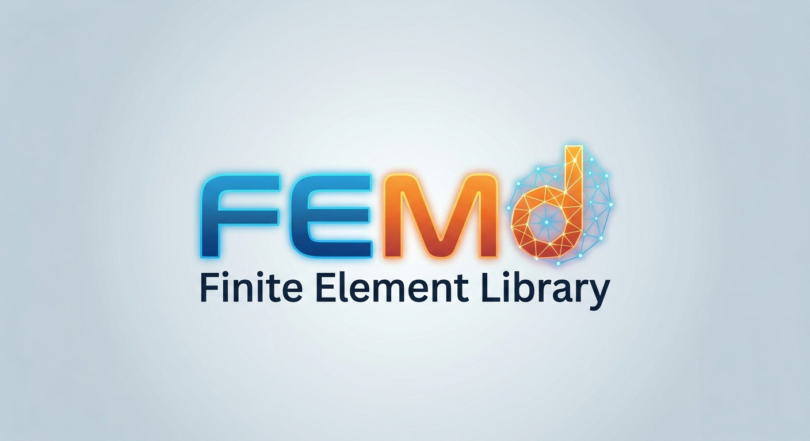

# FEMd



**Version 0.1.3** · [License: GPL v3 or later](LICENSE)

**FEMd** is a Finite Element Library for problems in one and two space dimensions. Its core is header-only C++17 and is used from Python. You give a domain, a polynomial degree and boundary conditions, write the equations in weak form, and FEMd assembles and solves them. The form language follows FEniCS, so FEniCS users will find the workflow familiar.

- **1D.** B-splines of any degree and continuity, Lagrange and DG elements. Dirichlet, Neumann, clamped, periodic and Robin conditions are built into the basis. Banded, cyclic and FFT solvers.
- **2D.** A Delaunay mesh generator with a guaranteed minimum angle, holes, markers, local refinement and coarsening, structured meshes and Gmsh import. Continuous $P_k$ elements on triangles and $Q_k$ on quadrilaterals of any degree, vector and mixed spaces (Stokes, Navier-Stokes), Raviart-Thomas, Nédélec and DG elements. Dirichlet, natural, periodic and slip conditions. VTK output for ParaView.
- **Solvers.** Symbolic Jacobians, sparse Cholesky and pivoting $LDL^T$, CG, GMRES and LGMRES with preconditioners, Newton and Newton-Krylov, implicit and explicit Runge-Kutta, SSP methods with limiters, and sparse eigenvalue solvers. Optional OpenMP.

## Installation

You need a C++17 compiler, Python 3.10 or later, NumPy and SciPy. Matplotlib is optional and is used by the plots and the examples.

```bash
git clone https://github.com/dmitsot/FEMd      # or Code > Download ZIP
cd FEMd
pip install .
```

`pip` builds the C++ extension, which takes a minute or two, and installs the package `femd`. Run it from the Python environment your notebooks use.

- **FFTW (optional).** If FFTW 3 is found at build time (`brew install fftw`, or `apt install libfftw3-dev`), the FFT solver backend is enabled. `fd.has_fftw()` tells you.
- **OpenMP (optional).** `pip install . -C cmake.define.FEMD_OPENMP=ON`. On macOS run `brew install libomp` first. See Section 1.1 of the manual.
- **Version.** `fd.__version__` gives the installed version.
- **Updating.** After downloading a new version, run `pip install .` again and restart the Python kernel.

The library has been developed on macOS. It is built and tested on Linux and macOS at every change.

## Quick start

Solve $-u'' + u = f$ on $(0, 1)$ with $u(0) = 0$, $u(1) = 1$ and cubic splines on 20 elements.

```python
import numpy as np
import femd as fd
from femd import D, dx

V = fd.SplineSpace(np.linspace(0, 1, 21), 3, bc="dirichlet", left=0.0, right=1.0)
u, v = fd.TrialFunction(V), fd.TestFunction(V)
f = (np.pi**2 + 1) * fd.sin(np.pi * fd.x) + fd.x

uh = fd.solve(D(u) * D(v) * dx + u * v * dx, f * v * dx)
print(uh(0.5))          # about 1.5, the exact solution is x + sin(pi x)
```

The same in 2D, Poisson's equation with $P_3$ elements on a triangulated square.

```python
m = fd.rectangle_mesh(0, 0, 1, 1, 32, 32)
V = fd.LagrangeSpace(m, 3, bc="dirichlet")
u, v = fd.TrialFunction(V), fd.TestFunction(V)
f = 2 * np.pi**2 * fd.sin(np.pi * fd.x) * fd.sin(np.pi * fd.y)
uh = fd.solve(fd.dot(fd.grad(u), fd.grad(v)) * fd.dx, f * v * fd.dx)
```

## Examples

The notebooks in [`examples/`](examples) run as they are after installation.

| notebook | problem |
|---|---|
| [example0](examples/example0.ipynb) | $-u'' + u = f$ with Dirichlet conditions, cubic splines, errors |
| [example1](examples/example1.ipynb) | the same with a Dirichlet and a Neumann condition |
| [example2](examples/example2.ipynb) | $-u'' + u^3 = f$ with Newton's method and Newton-Krylov |
| [example3](examples/example3.ipynb) | the BBM equation, a solitary wave with periodic cubic splines, RK4 and a Gauss method |
| [example4](examples/example4.ipynb) | the Bona-Smith system, a solitary wave reflected by a wall ($\eta_x = 0$, $u = 0$), a system of two fields |
| [example5](examples/example5.ipynb) | $-\Delta u + u = f$ in 2D on a square with a hole, $P_2$ elements, Dirichlet outside and free on the hole |
| [example6](examples/example6.ipynb) | the BBM-BBM system in 2D, a solitary wave in a channel with a cylinder, $P_1$ for $\eta$ and $P_2$ for $u$ with slip walls |
| [example7](examples/example7.ipynb) | the same problem with OpenMP, timing on 1, 2, 4, ... threads |
| [example8](examples/example8.ipynb) | the matrix of $-\Delta u + u$ on a general triangulation reordered by reverse Cuthill-McKee, sparsity patterns, bandwidth and Cholesky fill against AMD |
| [example9](examples/example9.ipynb) | a nonsymmetric system, convection-diffusion in a recirculating flow (double glazing), GMRES stagnating where LGMRES with ILU(0) converges |
| [example10](examples/example10.ipynb) | solitary waves of the Whitham equation, a nonlocal Fourier multiplier with a dense Jacobian, complex-step Newton-Krylov (`fd.csnewton`) against Newton with the dense Jacobian |
| [example11](examples/example11.ipynb) | the inviscid Burgers equation $u_t + u u_x = 0$ with DG elements and the Lax-Friedrichs flux up to $t = 1$, the formation of a shock, SSP Runge-Kutta with and without the TVB limiter |
| [example12](examples/example12.ipynb) | the slope limiters minmod, Van Leer, MC and Van Albada with the TVD2 and UNO2 reconstructions for DG, a square wave and a smooth hump advected once around |
| [example13](examples/example13.ipynb) | the heat equation $u_t = \Delta u$ on the unit square with $P_2$ elements and zero boundary values, backward Euler with a factored matrix against the exact solution, and Radau IIA with `fd.IRK` |
| [example14](examples/example14.ipynb) | the steady Navier-Stokes equations, flow around a cylinder at $Re = 20$ (DFG benchmark 2D-1), Taylor-Hood $P_2/P_1$ elements and Newton's method, drag, lift and pressure difference |
| [example15](examples/example15.ipynb) | vortex shedding behind a cylinder at $Re = 100$ (DFG benchmark 2D-2), the time-dependent Navier-Stokes equations with Radau IIA (`fd.IRK`) from the Stokes flow with a frozen Jacobian, the speed and the pressure at $t = 4$ and a movie of the speed (a few minutes) |
| [example16](examples/example16.ipynb) | output for ParaView: the heat equation in a plate with a hole, temperature and heat flux on quadratic VTK cells, a time series with `fd.VTKSeries` and the mesh with its boundary markers |
| [example17](examples/example17.ipynb) | a mesh from Gmsh (`pip install gmsh`): a plate with a circular inclusion, named sides and regions read with `fd.read_gmsh`, a piecewise constant conductivity from the regions, heat flux and output for ParaView |

## Documentation

- [Manual](docs/manual.md), the main ideas and worked examples in 1D and 2D.
- [API reference](docs/reference/index.md), every function and class.

## License

Copyright (C) 2026 D. Mitsotakis.

FEMd is free software: you can redistribute it and/or modify it under the terms of the [GNU General Public License](LICENSE) as published by the Free Software Foundation, either version 3 of the License, or (at your option) any later version. FEMd is distributed in the hope that it will be useful, but WITHOUT ANY WARRANTY, without even the implied warranty of MERCHANTABILITY or FITNESS FOR A PARTICULAR PURPOSE. See the GNU General Public License for more details.

## Author

FEMd was designed and developed by D. Mitsotakis (Victoria University of Wellington). The Delaunay mesh generator was developed in collaboration with T. Katsaounis.
